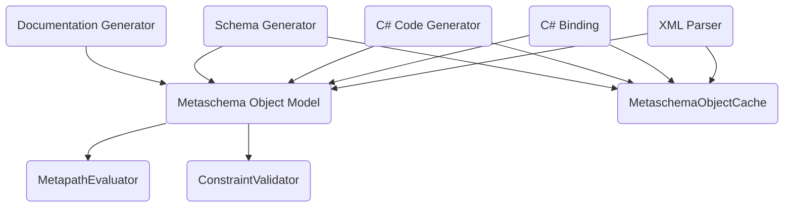

# NMetaschema Design and Architecture

## Summary

This document will explain the overall design and architecture for a C# library to parse Metaschema to provide object binding from different sources.

- Model definitions in Metaschema XML
- Annotated classes in C# to serialize, deserialize, or serve as first class definitions in place of XML only.

## Design

### Core

#### Metaschema Object Model

We will design and implement an object model like that of the `metaschema-java` implementation with [an abstract base class for the Metaschema root object and elements](https://github.com/usnistgov/metaschema-java/blob/14ad5b015d2f7e1990030f274b1ef9191e25fb2b/metaschema-model-common/src/main/java/gov/nist/secauto/metaschema/model/common/AbstractMetaschema.java#L52-L181) and [use of interfaces](https://github.com/usnistgov/metaschema-java/blob/14ad5b015d2f7e1990030f274b1ef9191e25fb2b/metaschema-model-common/src/main/java/gov/nist/secauto/metaschema/model/common/IMetaschema.java#L61-L308). 

The use of lazy evaluation and object model design has a notion of individual Metaschema definitions with import references, but not a top-level collection of "all Metaschemas defined or imported." This is implemented elsewhere in the library sub-systems, in a cache layer.

It is important, as this implementation stabilizes, to detect and honor the `scope` be it `local` or `global`. By definition, the default `scope` is `global`.

## Architecture & Sub-systems

The architectural approach, inspired by [`metaschema-java`](https://github.com/usnistgov/metaschema-java), has four important key sub-systems.

### Core

#### Metaschema Object Model

#### Metaschema XML Parser

#### Metaschema C# Binding

#### Metaschema C# Code Generator

### Optional

#### Schema Generation

#### Document Generation

#### Metapath Evaluation

#### Constraint Validator

#### Metaschema Object Cache

## Key Considerations

- In `metaschema-java`, the Java binding and code generator were written in the same package simultaneously, and were split out later.
- The Java implementation heavily utilizes annotations to allow making Java classes the primary definition of Metaschema in classes (without XML definitions).
  - The downside of consuming this (not implementing) for the `metaschema-java` implementation is that these class-based implementations can be less featureful than the official Metaschema XML language (some things like `flag`s are implemented out in the `metaschema-java` implementation). 
  - The other downside of this approach (in the current `metaschema-java` implementation) ignores the top-level metadata (`remarks` in the top-level; `metaschema-version`, et cetera).
- Make heavy use of lazy evaluation, such as:
  -  When definitions are detected, models are not instantiated until they are used upon use
  -  References to imported Metaschema definitions are stored as URI references in a map data structure, they are not "resolved" or loaded until they are needed.

## Appendix

### `metaschema-java` References

- The Metaschema object model for this library is in package [`metaschema-model-common`](https://github.com/usnistgov/metaschema-java/tree/14ad5b015d2f7e1990030f274b1ef9191e25fb2b/metaschema-model-common).
- The Metaschema XML parser is in package [`metaschema-model`](https://github.com/usnistgov/metaschema-java/tree/14ad5b015d2f7e1990030f274b1ef9191e25fb2b/metaschema-model) (or perhaps `metaschema-xml-model` as we can consider it now); at the time of this writing it is slated for significant future rewrite.
- The Metaschema to Java binding package in [`metaschema-java-binding`](https://github.com/usnistgov/metaschema-java/tree/14ad5b015d2f7e1990030f274b1ef9191e25fb2b/metaschema-java-binding) provides serialization and deserialization support to and from Java objects (POJOs) and JSON, XML, YAML.
- The Metaschema to Java code generator in [`metaschema-java-codegen`](https://github.com/usnistgov/metaschema-java/tree/14ad5b015d2f7e1990030f274b1ef9191e25fb2b/metaschema-java-codegen) is responsible for generating Java classes used by the `metaschema-java-binding` package.